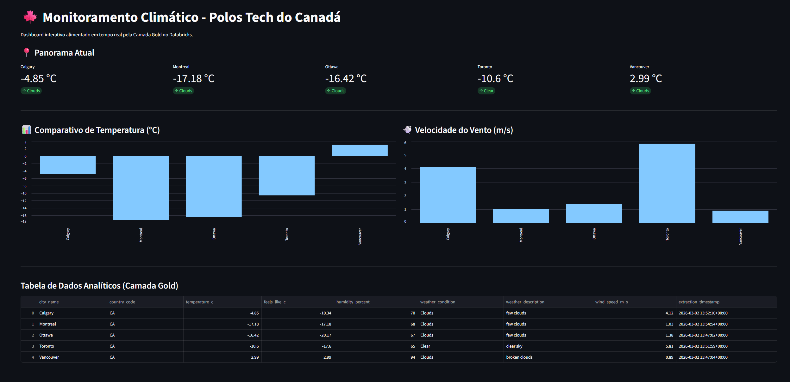

# canada-weather-data-pipeline# 🍁 Canada Tech Hubs: Real-Time Weather Data Pipeline

🌎 [Read in English](README_EN.md) | 🇧🇷 [Ler em Português](README.md)

Este projeto é um pipeline de Engenharia e Análise de Dados *End-to-End* que extrai dados climáticos ao vivo dos principais polos tecnológicos do Canadá (Toronto, Vancouver, Montreal, Calgary e Ottawa) e os exibe em um Dashboard interativo. O objetivo principal foi lidar com dados dinâmicos em formato JSON e contornar restrições de segurança em infraestruturas modernas de nuvem.

## 📊 Dashboard Final (Streamlit)

  

## 🛠️ Arquitetura e Tecnologias
* **Fonte de Dados:** OpenWeatherMap API (REST API)
* **Processamento (Cloud):** Databricks (Serverless Compute)
* **Linguagens:** Python (PySpark) e SQL
* **Armazenamento:** Delta Lake (Medallion Architecture)
* **Visualização:** Streamlit (Conexão via Databricks OAuth)

## 🚀 O Pipeline de Dados (Medallion Architecture)

1. **Extração & Camada Bronze (Raw Data - PySpark):**
   * Requisições HTTP para a API do OpenWeatherMap.
   * *Desafio Técnico:* Em ambientes Databricks Serverless, a gravação de arquivos temporários locais é bloqueada por segurança. A solução foi processar o JSON 100% em memória utilizando as funções nativas `schema_of_json` e `from_json` do PySpark para inferir a estrutura dinamicamente.
   * Salvamento em formato Delta usando modo `append` para construção de histórico.

2. **Camada Silver (Cleansed - Puro SQL):**
   * Uso de notação de ponto (`main.temp`) para desempacotar dados aninhados (Structs).
   * Uso de índices (`weather[0]`) para extrair dados de Arrays.
   * Tratamento e conversão do tempo de extração do formato Unix Epoch para Timestamp legível.

3. **Camada Gold (Business View - Puro SQL):**
   * Aplicação de **Window Functions** (`ROW_NUMBER() OVER(PARTITION BY... DESC)`) para isolar apenas a leitura meteorológica mais recente de cada cidade. Isso garante que o Dashboard consuma apenas a "foto atual", ignorando o histórico empilhado.

4. **Aplicativo Web (Interface Visual):**
   * Interface construída com Streamlit em Python.
   * Conexão segura e direta ao Databricks utilizando **Autenticação OAuth** (`databricks-sql-connector`), adequando-se às exigências de segurança modernas que bloqueiam Tokens Pessoais (PAT) em acessos externos.
